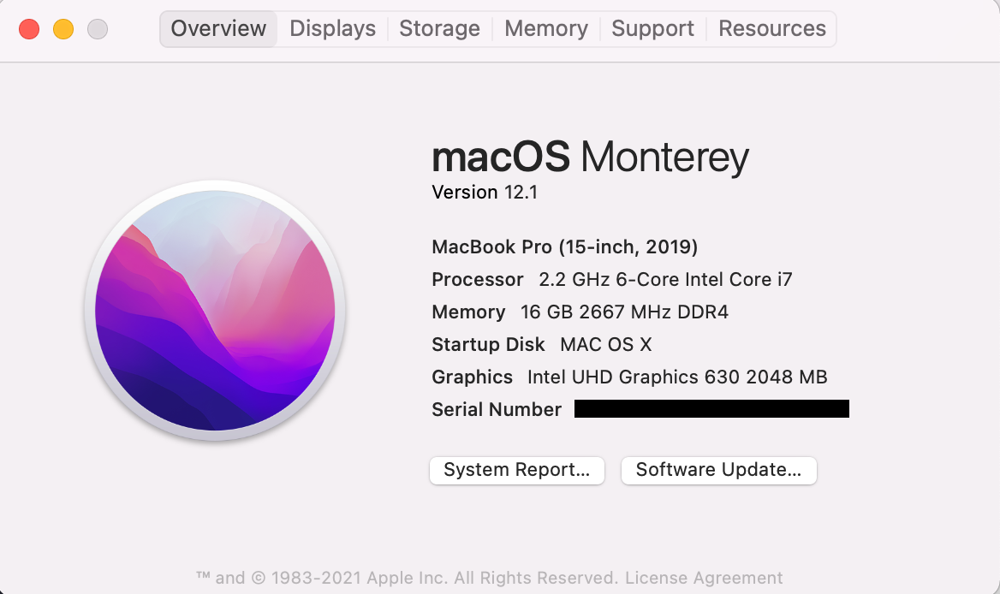

# XPS9570-Hackintosh-OC

XPS9570 OpenCore configurations supported for Monterey(12.1)

### Hardware

| Model          | XPS9570               | Enabled |
| -------------- | --------------------- | ------- |
| CPU            | i7-8750H(Coffee Lake) | ✅       |
| Memory         | 16GB                  | ✅       |
| Display        | Touch 4k Sharp        | ✅       |
| HD             | Predator GM3500       | ✅       |
| WiFi/Bluetooth | Killer Wireless 1535  | ❌       |
| GPU            | GTX 1050Ti            | ❌       |

### Sources

- https://github.com/LinhNC/XPS9570-OpenCore
- https://github.com/ic005k/OCAuxiliaryTools
- https://github.com/baranovskis/xps9570-hackintosh
- https://blog.daliansky.net/macOS-Monterey-12.1-21C52-Release-version-with-OC-0.7.6-CLOVER-5143-and-FirPE-original-image.html
- https://blog.daliansky.net/Morefine-S500-and-macOS-Monterey-Installation-Tutorial.html
- https://hpglw.com/b6fca43e.html
- [https://github.com/xxxzc/xps15-9570-macos](https://github.com/xxxzc/xps15-9570-macos)
